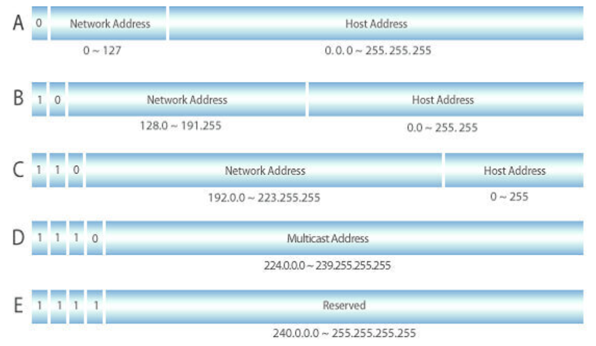
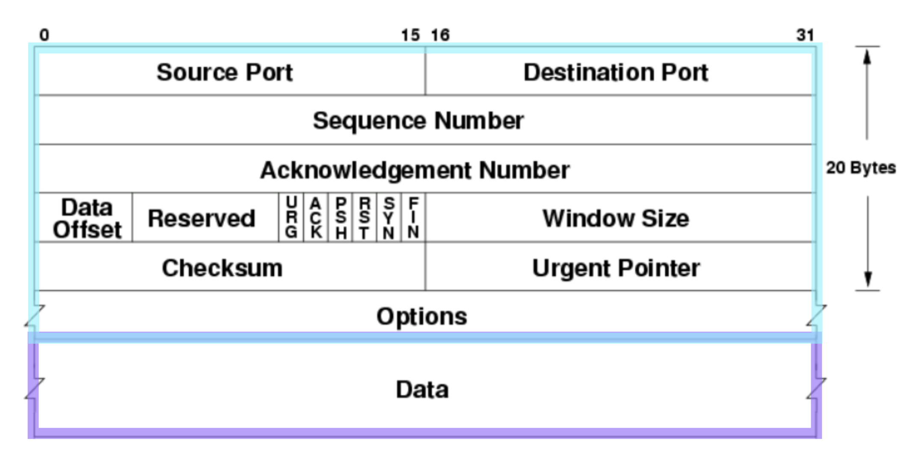
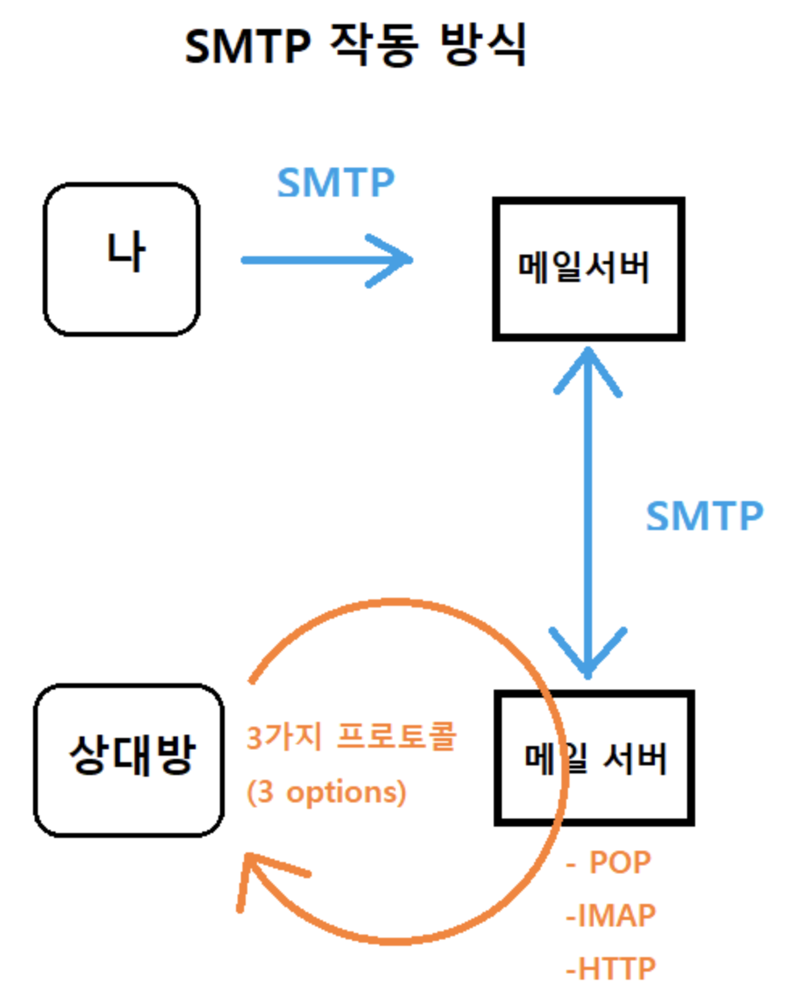

# 1과제

## 시스템 보안

- 바이러스
    - 악성코드의 가장 `일반적인 형태` 대부분 악성코드와 혼용하여 사용
    - CPU 사용, 메모리 점유, 데이터 손상, 시스템 작동 방해
    - `전염성`이 가장 큰 특징. `자가 복제`하여 피해 범위 확대
- 웜
    - `네트워크`를 통해 전파, **가능한 많은 컴퓨터 감염** 목적
    - 바이러스 = `**파일 손상**` / 웜 = `**네트워크 트래픽 발생**`
- 쿠키
    - 유저들의 `효율적이고 안전한 웹 사용`을 보장하기 위해 사용
    - 접속자의 **개인 장치에 다운로드** 되고 `**브라우저에 저장**`
    - 구성요소 : `**Name / Value / Expires / Domain / Path / Secure / HTTP Only**`
    - 쿠키 종류
        - **Session Cookie** : 보통 만료시간을 설정하고 `**메모리에만 저장**`, 브라우저 **종료시 삭제**
        - **Persistant Cookie** : **장기간 유지**되는 쿠키, `**파일로 저장**`되어 브라우저 종료와 관계 없음
        - **Secure Cookie** : `**HTTPS**`에서만 사용, 쿠키 정보가 `**암호화**` 되어 전송
        - **Third-Party Cookie** : 방문 도메인과 다른 도메인의 쿠키, `**트래킹**`에 사용
- 윈도우 기본 그룹
    - **Adminstrator** : 도메인 자원이나 로컬 컴퓨터에 대한 `**모든 권한**`이 존재
    - **Account Operators** : 사용자나 그룹 `**계정을 관리**`
    - **Backup Operators** : `**백업**을 위해`, 모든 시스템과 파일과 디렉토리에 접근 가능
    - **Guests** : 도메인 사용 **권한이 제한**, **시스템 설정 변경 불가능**
    - **Print Operators** : 도메인 `**프린터**`에 접근 가능
    - **Power Users** : `**디렉토리나 네트워크 공유**` 가능, `**공용 프로그램 그룹 생성**` 가능, `**표준 시간**` 설정
    - **Replicator** : 도메인에 있는 **파일 복제** 가능, `**디렉토리 복사 서비스**`에 이용
    - **Server Operators** : 도메인의 `**서버를 관리**` 가능, `**로컬 로그인, 시스템 재시작, 시스템 종료**` 가능
    - **Users**
        - 도메인과 로컬 컴퓨터를 `**일반적**으로 사용`
        - 개인에게 할당된 사용자 환경을 만들 수 있지만 `**설정 항목에 한계**`가 있음
        - `시스템 서비스`를 시작 or 종료할 수 있는 `**권한 X**` / 디렉토리 `**공유 설정 불가능**`
        - 자신의 모든 데이터 파일 및 레지스트리에서 `**자신의 부분을 완전히 제어 가능**`
- 윈도우 레지스트리
    - `**시스템 구성 정보**`를 저장한 데이터베이스
    - 프로세스 종류, 주기억장치 용량, 주변 장치 정보, 시스템 매개변수, 응용 SW에서 취급하는 파일
    - Ex) 마우스 우클릭시 실행되는 정보 / **.txt 같은 확장자를 어떤 프로그램으로 열지** 등
    - 종류
        - **HKEY_CLASSES_ROOT** : `**확장자**`에 대한 정보, `**파일과 프로그램간 정보**` 포함
        - **HKEY_CURRENT_USER** : `**컴퓨터 환경 정보**` 저장, 각 `**사용자 별 프로파일**` 저장
        - **HKEY_LOCAL_MACHINE** : `**하드웨어** 동작`에 필요한 `**드라이버** 및 **설정**` 관련 정보 저장
        - **HKEY_USERS** : `데스크탑 **설정**` 및 `네트워크 **연결**` 정보
        - **HKEY_CURRENT_CONFIG** : 제일 **단순한** 부분, `**디스플레이와 프린터**`에 관한 정보
- 유닉스/리눅스 시스템 - 파일 관리
    
    ### Unix File System 개요
    
    ---
    
    - `**Tree**` 구조
    - 디렉토리나 주변 장치를 **파일과 동일**하게 취급
    - **파일 소유자, 그룹, 그 외 사용자**를 구분하여 파일을 보호
    
    ### Unix File System 구조
    
    ---
    
    - **Boot Block**
        - Unix 커널을 적재 시키기 위해 `**부팅 시 필요한 코드**`를 저장하고 있는 영역
    - **Super Block**
        - 총 블록의 개수, 블록 크기 등 `**전체 파일 시스템에 관한 정보**`를 저장
    - **i-node Block**
        - `각 **파일이나 디렉토리에 대한** 대부분의 정보`를 가지고 있는 영역 ( **인덱스** 노드 )
    - **Data Block**
        - `**실제 데이터**`가 저장되는 공간
    
    ### i-node
    
    ---
    
    - **i-node** : 하나의 **파일 / 디렉토리의 모든 정보**를 가진 `**64Byte**` 테이블
    - **i-node Table** : `**전체 i-node**`를 가지고 있는 테이블
    - **i-number** : i-node가 i-list에 등록되는 `**Entry number**`
    - **Addressing** : `**13개의 블록 위치**`를 관리 ( **12개의 직접, 1개의 간접** 데이터 블록 )
- 유닉스/리눅스 시스템 - 네트워크 명령어
    - **ifconfig** - 네트워크 `인터페이스 **상태**`
    - **netstat -an** - 현재 시스템에서 사용되는 **네트워크 `서비스의 상태`**
    - **top** - CPU, 메모리 등 `**시스템 자원의 사용 현황**`
    - **ps -elf(-aux)** - 현재 시스템에서 `**수행 중인 데몬과 프로그램**`의 상태
    - **who, w** - 현재 로그인 되어있는 `**사용자**`
    - **snoop** - 네트워크 인터페이스를 통한 `**패킷 캡쳐하여 분석**`
    - **nslookup** - `**도메인**`과 관련된 여러가지 검색
    - **hostname** - 현재 시스템에 할당된 `**호스트 이름**`
    - **traceroute** - 특정 호스트까지 가는데 `**어떠한 경로를 거쳐서 도달하는 지**` 보여준다
    - **inetd** - `**네트워크 슈퍼데몬**`인 **inetd**를 실행 시킨다
    - **tcpdump** - 네트워크 `**패킷 분석**`
- 유닉스/리눅스 시스템 - 로그 파일
    
    <aside>
    📌 Unix - /var/**adm**
    Linux - /var/**log**
    로그 파일이 `**Binary**` 형태로 저장되어 있어서 `**cat 명령어 사용 불가**`
    
    </aside>
    
    - utmp(x)
        - 현재 **로그인한 사용자 정보**
        - **w, who, finger**
    - wtmp(x)
        - 사용자의 `**성공한 로그인/로그아웃**` 정보, `**Boot/Shutdown**` 정보
        - **last**
    - lastlog
        - 가장 **최근에 성공한 로그인 기록**
        - **lastlog(Linux), finger**
    - btmp(Linux) / loginlog(Unix)
        - **실패한 로그인 시도**에 대한 기록
        - **lastb(Linux), Unix** - **텍스트** 파일
    - secure(Linux) / sulog(Unix)
        - **su 명령어 사용** 기록
        - **Linux + 사용자 인증**에 대한 정보 기록
    - acct / pacct
        - 로그인한 모든 **사용자가 로그아웃 할 때까지 입력한 명령어, 터미널, 프로세스 시작 시간** 등
        - **lastcomm**
    - messages
        - 가장 **기본적인 시스템 로그** 파일
        - **시스템 운영에 대한 전반적인 메시지** 저장
    - xferlog(Linux)
        - **FTP** 로그 파일
- 시스템 취약점
    
    ### Memory Corruption
    
    ---
    
    - Buffer Overflow
        - 가장 대표적인 취약점
        - 할당한 크기의 **버퍼보다 더 큰 데이터를 입력** 받아 생기는 오류
    - Out-Of-Boundary
        - 버퍼의 길이 **범위를 벗어나는 곳의 데이터에 접근** 가능한 취약점
    - Off-By-One
        - 경계 검사에서 **하나** 많은 값을 쓸 수 있을 때 발생하는 취약점
        - **인덱스를 잘못 계산**하거나, **반복문**을 순회할 때, **잘못된 비교 연산자**를 사용하는 경우 발생
    - Format String Bug
        - **포맷 스트링 문자열을 올바르게 사용하지 못했을 때** 발생하는 취약점
    - Double Free / Use-After-Free
        - **동적 할당된 메모리를 정확히 관리하지 못하였을 때** 발생하는 취약점
    
    ### Logical Bug
    
    ---
    
    - Command Injection
        - **Shell**에 사용자가 어떤 입력을 했을 때 **정확한 검사를 하지 않아서** 발생하는 취약점
    - Race Condition
        - **Thred나 Process의 자원 관리**를 정확히 수행하지 못해 **데이터가 오염**되는 취약점
    - Path Traversal
        - 개발자의 **예상 밖의 디렉토리에 접근**하는 취약점
- 클라우드 컴퓨팅
    
    <aside>
    📌 `**컴퓨팅 리소스**`를 **인터넷을 통해 서비스**로 사용할 수 있는 `**주문형 서비스**`
    
    </aside>
    
    > 기업에서 **직접 리소스를 조달하거나, 구성, 관리할 필요가 없으며**
    `**사용한 만큼만 비용**`을 지불하면 된다.
    > 
    - 인터넷을 통해 주문형 컴퓨터 리소스, 소프트웨어, 정보를 공유한다는 개념
    - `**사용한 만큼만 비용을 지불**`한다는 장점
    
    ### IaaS ( Infrastructure as a Service )
    
    - **컴퓨팅, 스토리지, 네트워킹, 가상화 등 IT 인프라 서비스**에 대한 주문형 액세스 제공
    - `**IT 리소스를 가장 높은 수준**`으로 제어
    
    ### PaaS ( Platform as a Service )
    
    - 클라우드 애플리케이션 **개발에 필요한 모든 하드웨어 및 소프트웨어 리소스 제공**
    - 기본 인프라의 관리 및 유지보수에 대한 부담 없이 `**애플리케이션 개발에만 집중 가능**`
    
    ### SaaS ( Software as a Service )
    
    - **기본 인프라에서 유지보수 및 소프트웨어 자체 업데이트**까지 **전체 스택**을 서비스로 제공
    - 클라우드 인프라 제공업체에서 `**서비스, 인프라를 모두 관리하고 유지보수함**`
    
    ## 클라우드 보안 솔루션 유형
    
    ---
    
    - ID 및 액세스 관리 (`**IAM**`)
    - 데이터 손실 방지 (`**DLP**`)
    - 보안 정보 및 이벤트 관리 (`**SIEM**`)
    - 공개키 인프라 (`**PKI**`)

## 네트워크 보안

- IPv4 / IPv6
    
    ## IPv4 ( Internet Protocol version4 )
    
    ---
    
    <aside>
    📌 현재 대부분의 네트워크에서 사용되고 있는 IP 체계이다.
    
    </aside>
    
    - 각 옥텟의 숫자는 **0~255**까지 표현 가능하고 한 옥텟에 **256(2^8)**가지 경우의 수 표현 가능
    - 한 옥텟 당 **8비트** 씩, 총 **4개의 옥텟**으로 **32비트 체계**이다.
    - 최대 약 `**40억개**`의 서로 다른 주소 할당 가능
    
    ### IPv4 주소의 구성
    
    - **Network ID** : 해당 컴퓨터가 **소속된 네트워크에 배정된 이름**
    - **Host ID** : 해당 물리적 **컴퓨터에 배정된 이름**
    
    ### 클래스
    
    - **A~E 클래스**까지 나누어져 있으며, 각 클래스는 **해당 주소가 표현 가능한 네트워크와 호스트의 수**
    
    
    
    ## IPv6 ( Internet Protocol version6 )
    
    ---
    
    <aside>
    📌 IETF ( 국제 인터넷 표준화 기구 )
    IPv4 주소가 고갈될 것으로 예측하고 새로운 주소 체계인 IPv6 개발
    
    </aside>
    
    - **16비트씩 8부분**으로 각 부분을 **콜론**(:)으로 구분하는 **128**비트 주소 체계
    - 클래스가 아닌 **유니캐스트, 애니캐스트, 멀티캐스트의 형태로 IP를 할당**
- TCP / UDP 특징
    
    ## TCP ( Transmission Control Protocol )
    
    ---
    
    <aside>
    📌 Internet 상에서 데이터를 메시지 형태로 보내기 위해 IP와 함께 사용하는 규약
    
    </aside>
    
    ### 단점
    
    - 데이터를 보내기 전에 반드시 **연결이** 되어야 함
    - **1:1** 통신만 가능
    - **UDP** 보다 전송 속도가 **느리다**
    
    ### 특징
    
    - 연결형 서비스로 **연결이 성공해야 통신이 가능**하다
    - 데이터의 **전송 순서 보장**
    - **신뢰성 있는 데이터를 전송**
    - **데이터 흐름 제어 및 혼잡 제어**
    - **3-Way Handshaking / 4-Way Handshaking**
    - **가상 회선** 방식
    
    ## UDP ( User Datagram Protocol )
    
    ---
    
    <aside>
    📌 전송 계층의 **비연결** 지향 프로토콜
    
    </aside>
    
    ### 단점
    
    - 데이터의 **신뢰성이 없다**
    
    ### 특징
    
    - **비연결** 지향 프로토콜로 **연결 없이 통신 가능**
    - **데이터그램** 통신 방식 채택 ( 가상 회선 X )
    - **TCP** 보다 전송 속도가 **빠르다**
    - 데이터를 보내고 받는다는 신호 방식이 없다
- TCP 세그먼트
    
    ## TCP Segment
    
    ---
    
    <aside>
    📌 TCP Segment = TCP Header ( `**20bByte**` ) + Data ( `**n Byte**` )
    
    </aside>
    
    
    
    - Source Port : 송신포트, **16비트** 할당, 송신측의 **포트** 번호
    - Destination Port : 수신포트, **16비트** 할당, 수신측의 **포트** 번호
    - Sequence Number : **32**비트 할당, **송신 바이트 흐름의 위치**를 가리킴
    - **Acknowledgement Number**
        - **32비트** 할당
        - **ACK** 플래그 설정 시 필드 값은 수신자가 예상하는 **다음 Sequence Number**
    - **Data** **Offset** : **4비트** 할당, 헤더가 아닌 **데이터의 시작 위치**를 알려줌
    - **Reserved** : 3비트 할당, **미래에 사용하기 위한 필드**, 모두 **0으로 채워짐**
    - Flag : **1비트씩 9비트**로 할당, **현재 세그먼트의 속성**을 나타냄
    - Window Size : **한번에 전송할 수 있는 데이터의 양**, 최대 크기 **64Byte** ( 2^16 )
    - Check Sum : **오류 검출을 위해 존재, 변조 감지**
    - Urgent Pointer : **긴급** **포인터**, UPG 플래그가 **1이면 이 값이 가리키는 데이터를 우선 처리**
    - Options : **TCP의 기능 확장시 사용하는 필드, `가변적` 크기**이다
- 네트워크 장비
    
    ### NIC ( Network Interface Card ) | NIC
    
    ---
    
    <aside>
    📌 컴퓨터를 **`LAN`** ( Local Area Network )에 연결 시키는 장비
    
    </aside>
    
    - 요즘 대부분의 NIC는 **메인보드에 탑재** 되어 나온다
    
    ### Hub
    
    ---
    
    <aside>
    📌 네트워크 **중심축에** 놓여 **여러 컴퓨터들을 연결**해주는 장비
    
    </aside>
    
    - **더미 허브**는 OSI 7계층 중 `**1계층**`에 속한다
    - **스위칭 허브**는 OSI 7계층 중 **`2계층`**에 속한다
    
    ### Repeater
    
    ---
    
    <aside>
    📌 중계기, **신호를 증폭**하여 전송해주는 장비
    
    </aside>
    
    - **데이터를 먼 거리까지 전송** 가능
    - 요즘은 **다른 장비에 부가 기능**으로 포함됨
    
    ### Bridge
    
    ---
    
    <aside>
    📌 **전기적인 충돌**이 일어날 수 있는 **2개의 세그먼트를 연결하여 충돌 위험을 줄이는 장비**
    
    </aside>
    
    - 데이터의 전송 위치를 확인하여 **불필요한 트래픽과 충돌 방지**
    
    ### Router
    
    ---
    
    <aside>
    📌 **서로 다른 네트워크끼리의 통신**을 위해서 사용되는 장비
    
    </aside>
    
    - OSI 7계층 중 **3계층**에 속해있는 장비
    - **IP 주소를 기반**으로 데이터가 이동할 **최적의 경로를 설정**
    
    ### Gateway
    
    ---
    
    <aside>
    📌 **네트워크로 들어가는 입구 역할**을 해주는 장비
    
    </aside>
    
    - **라우터나 스위치** 등을 필요로 함
    - **Bridge**와는 **다르다**
- 무선 네트워크
    
    ## Wireless Network
    
    ---
    
    ### IEEE 802.11
    
    - 흔히 **무선랜**, **와이파이**라고 부르는 `**무선 근거리 통신망**`을 위한 기술
    
    ### WIFI 2.4Ghz
    
    - 가장 **기본적인 주파수**이자, **모든 기기에서 호환**되는 주파수
    - **주변 기기가 없고, 장애물이 많을 때** 유리
    
    ### WIFI 5Ghz
    
    - 포화 상태인 **2.4Ghz 대역을 피하기 위해 나온 주파수**
    - **802.11ac는 5Ghz**만 지원
    - **속도가 높고 주파수 간섭이 없다.**
    - **장애물 통과** 시 신호가 **급속히 감소**
    
    ### Authentication ( 인증 )
    
    - **WPA** ( WI-FI Protected Access )
        - 와이파이 보호 접속, 와이파이 얼라이언스의 감시 하에 수행하는 인증 프로그램
        - **TKIP** 암호화 사용
    - **WPA2** ( WI-FI Protected Access )
        - **2세대 WPA**, **보안 기능이 개선**
        - 고급 암호 표준 ( **AES** ) 암호화 지원
        - 비밀번호의 길이를 **8~63**자 이하로 사용
    - IEEE 8021x
        - **포트 기반 네트워크 접근 제어**에 대한 **IEEE** 표준
        - **Radius** 서버를 통한 인증 절차 추가
    
    ### Privacy ( 암호화 )
    
    - **WEP** ( Wired Equivalent Privacy )
        - **고정 암호키 방식**
        - **무선 랜 통신**을 암호화하는 **가장 기본적인 방법**
        - **802.11b** 프로토콜부터 적용
        - **64, 128bit** 암호화 방식을 사용하며 기본적으로 **RC4** 알고리즘 사용
    - **TKIP** ( Temporal Key Integrity Protocol )
        - **임시 키** 무결성 프로토콜
        - **IEEE 802.11**에 사용되는 보안 프로토콜
        - **WEP** < **TKIP** < **AES**
    - **AES** ( Advanced Encryption Standard )
        - **고급 암호화 표준**
        - **128, 192, 256bit** 등 **가변** 키 크기를 갖는 **수학적 암호화 알고리즘** 사용
        - 암호화된 데이터는 AES 알고리즘의 **키 없이 복호화 불가능**
- SSH
    
    ### SSH ( Secure SHell )
    
    - **데이터 전송**이나, **원격 제어**를 위해 사용
    - **FTP**나 **Telnet**보다 **보안적인 면에서 우수**하다
    - **Public Key와 Private Key**를 이용하여 통신
    - TCP **22** 포트 사용
- ICMP
    
    ### ICMP ( Internet Control Message Protocol )
    
    - **에러 발생 시 원인**을 알려주거나 **네트워크 상태 진단** 기능
    - **Destination Unreachable** ( Type 3 )
        - 해당 **목적지에 도달할 수 없음**을 의미
        - Code 1 ( Host Unreachable ) : `**최종 라우터**`가 **호스트로 패킷 전송 실패**
        - Code 2 ( Protocol Unreachable ) : 호스트에서 해당 **프로토콜 사용 불가**
        - Code 3 ( Port Unreachable ) : 호스트에 해당 **UDP 포트가 열려있지 않음**
        - Code 4 : **단편화** **불가**
    - **Redirection** ( Type 5 )
        - **라우팅 경로가 잘못되어 새로운 경로를 이전 경유지나 호스트에게 알려줌**
        - I**CMP Redirect 공격 시** 이용하는 메시지
    - **Time Exceeded** ( Type 11 )
        - **타임 아웃이 발생**하여 **패킷이 폐기** 되었음을 알리는 메시지
        - **Code 0** : TTL 값이 **0이 되어 패킷 폐기**
        - **Code 1** : **재조합** 과정에서 **타임 아웃이 발생하여 패킷 폐기**
    - **Echo Request** ( Type 8 ) / Echo Reply ( Type 0 )
        - **ping** 테스트에 사용되는 메시지로 **End 노드간 네트워크 및 호스트 상태 진단**
- DOS, DDOS
    
    ### DoS ( Denial Of Service )
    
    > **서비스 거부 공격**, 피해자를 **서비스 불가 상태**로 만든다.
    > 
    - **Ping Of Death** : ICMP 패킷을 **매우 큰 크기**로 보내, 시스템에 **부하** 발생
    - **Land Attack** : **Source IP와 Destination IP 주소를 같게** 만들어 보내는 공격
    - **Smurf Attack** : **Source IP를 피해자의 IP로 변경** 후 **특정 네트워크에 ICMP Request**를 보냄
    - **Teardrop Attack** : **Fragment Offset**을 **틀리게** 전달 후, 시스템에 **문제를 발생 시킴**
    
    ### DDoS ( Distrubuted Denial Of Service )
    
    > **DoS** 공격을 **분산적으로** 여러 컴퓨터가 수행하는 것
    > 
    - **UDP / ICMP Flooding** : **다량의 패킷**을 전송하여 **대역폭을 가득 채움**
    - **SYN Flooding** : **다량의 SYN 패킷**을 보내, **`Backlog Queue`**를 가득 채움
    - **HTTP GET Flooding** : **동일한 URL을 반복 요청**하여 웹서버에 **부하를 줌**
- Spoofing
    
    ### Spoofing
    
    > ‘**속이다**'라는 의미를 가졌다
    > 
    
    ### ARP Spoofing Attack
    
    - **ARP Table**에 있는 **피해자의 MAC 주소를 공격자의 MAC 주소**로 바꿈
    - **모든 패킷 흐름이 공격자**를 통하도록 한다
    - ARP Table이 변경되지 않도록 MAC 값을 **정적으로 고정시켜 예방**
    
    ### IP Spoofing Attack
    
    - **트러스트** 관계에 있는 서버와 클라이언트를 확인한다
    - 그 후 **클라이언트에 DoS 공격을 하여 서버와의 연결을 끊는다**
    - **클라이언트의 IP를 확보**하여 **인증 절차 없이 서버에 접근**할 수 있다
    - **트러스트 인증법**을 **사용하지 않는게 가장 확실한 예방법**
    
    ### DNS Spoofing Attack
    
    - **DNS 서버보다 빠르게 위조된 DNS Response 패킷**을 보낸다
    - **피해자가 잘못된 IP 주소로 웹 접속**을 하게 만드는 공격
    - **DNS Query 대신 hosts 파일에 등록**하는 것으로 공격 방지
    - 하지만 **모든 서버를 등록하는 것은 어렵기 때문에** 완벽히 방어하기는 어렵다
- 방화벽
    
    ### 방화벽 ( Firewall )
    
    - **외부 네트워크로부터 내부 네트워크를 보호**하는 보안 장치
    - 외부와 내부 네트워크 **사이의 유일한 연결점**에 위치
    - 장점
        - **보안 취약점을 가지고 있는 서비스의 보호**
        - **보안 정책 구현**
        - 네트워크 사용에 대한 **통계자료 제공**
    - 단점
        - **내부 공격에 무방비**
        - **서비스의 제한**
        - 바이러스와 같은 **악성 프로그램에 무방비**
    - **NAT** ( Network Address Translation ) 기능
        - 내부 네트워크와 **외부 서버와의 통신을 위해 가상 IP 주소**를 부여
    - **Packet Filtering**
        - 들어오는 **패킷에 규칙을 적용**하고 **전달과 폐기 결정**
        - **침입차단시스템은 양쪽 방향에서 들어오는 패킷 모두**를 필터링
        - **필터링 규칙은 네트워크 패킷에 포함된 정보**에 기초
    - **Application Level Gateway**
        - == **Proxy Serve**r
        - **Packet Filtering 보다 안전**
        - 외부와 내부 네트워크간의 **직접적인 패킷 교환 허용하지 않는다**
    - **Circuit Level Gateway**
        - 두 개의 **TCP 연결**을 설정
        - **컨텐츠 필터링을 못한다**
        - **내부 호스트 숨김, Application Level 보다 저렴**

## 애플리케이션 보안

- SMTP
    
    ### SMTP ( Simple Mail Transfer Protocol )
    
    ---
    
    - 일반적으로 전자 메일의 **`전송`**을 위한 **표준 프로토콜**
    - 전자 메일을 **송수신**하는 서버 == **SMTP Server**
    
    
    
    - TCP / **25** Port
- HTTP
    
    ### HTTP ( HypeText Transfer Protocol )
    
    ---
    
    - TCP / `**80**` Port
    - Request : Client → Server
    - Response : Server → Client
    - **`비연결성`** 프로토콜
    - State Code
        - 1XX : 요청을 받았으며, **작업을 계속**한다
        - 2XX: **성공적**으로 처리
        - 3XX : **리다이렉션** 완료. 클라이언트 추가 동작 요구
        - 4XX : **Client Error**
        - 5XX : **Server Error**
- SSL/TLS
    
    ### SSL ( Secure Socket Layer )
    
    ---
    
    - **개인정보 보호, 인증, 데이터 무결성**을 위해 개발
    - **평문 데이터를 암호화**, **복호화 거의 불가능**
    - **`SSL 3.0`** 이후 **업데이트 X**
    
    ### TLS ( Transfer Layer Security )
    
    ---
    
    - **SSL**의 **업데이트** 버전
    - SSL과 거의 **차이 X**, 명칭만 다르다
    
    ### SSL/TLS Handshake
    
    ---
    
    - **RSA** 키 교환 알고리즘 사용
    - **HTTPS** 웹에 커넥션할 때 사용
    
- HTTPS와 S-HTTP
    
    ### HTTPS
    
    ---
    
    - TCP / **443** Port
    - **HTTP**와 **SSL**을 합친 것
    - **RC4** 스트림 암호 알고리즘
    
    ### S-HTTP ( Secure HyperText Transfer Protocol )
    
    ---
    
    - 네트워크 **트래픽 암호화의 `종류`**
    - **SSL**을 **사용하지 않는다**
    - **Message** 단위로 암호화
    
    ### 차이점
    
    ---
    
    - **HTTPS**는 **모든 통신의 데이터**를 `**암호화**`
    - **S-HTTP**는 **SSL**을 사용하지 않고 **`Message`** 단위로 **`암호화`**
    
    <aside>
    📌 Ex. [송신] 나는 밥을 먹는다
    HTTPS : 1fae8afs153fesf5s135af3
    S-HTTPS : [송신] a4e6s8f4ase86ffsd15
    
    </aside>
    
- OWASP TOP 10(2022)
    
    ### Broken Access Control
    
    ---
    
    - 사용자가 **수행할 수 있는 것에 대해 제한이 제대로 적용되지 않는** 취약점
    - 대표적으로 **파일 다운로드, 파일 업로드, URL 파라미터 조작 우회**가 있다
    - `**권한 설정**`을 통해 예방
    
    ### **Cryptographic failures**
    
    ---
    
    - **암호화의 오류**로 발생하는 취약점이다
    - **평문 전송, 취약한 암호 프로토콜이나 알고리즘**을 사용하는 경우 발생
    - `**강력한 최신 암호 프로토콜, 알고리즘`** 사용으로 예방
    
    ### **Injection**
    
    ---
    
    - **Source Code를 통해 감지됨**
    - **XSS, SQL Injection, XML Injection** 등이 포함됨
    - `**특수문자 필터링**` 등으로 예방
    
    ### **Insecure design**
    
    ---
    
    - **안전하지 않은 설계**로 발생하는 취약점
    - `**구현 전**`, **기획과 설계 단계에서 발생**하는 보안 결함
    - `**기획과 설계 단계에서 보안 설계**`를 하는 것으로 예방
    
    ### **Security misconfiguration**
    
    ---
    
    - **애플리케이션을 최초 설치하거나 업데이트 시 보안성을 고려하지 않는 `설정`**으로 발생하는 취약점
    - Ex. **불필요한 기능, 포트 활성화 / 데이터베이스 등 보안 설정 누락**
    - `**불필요한 기능 제거, 모든 환경에서 보안 설정 검증**`
    
    ### **Vulnerable and outdated components**
    
    ---
    
    - **취약한 버전 또는 기술 지원이 종료 상태**인 **소프트웨어를 계속 사용**하여 발생하는 취약점
    - **서비스를 구성하는 모든 요소가 포함**된다
    - `**소프트웨어 최신 버전 유지, 불필요한 소프트웨어 제거**`
    
    ### **Identification and authentication failures**
    
    ---
    
    - `**식별 및 인증에 실패**`하여 발생하는 취약점
    - **2차 인증이나 실패에 대한 제한이 없어** `**Brute Forcing**` 공격에 노출되는 경우가 포함된다
    - `**2차 인증 구현 및 패스워드 정책 강화**`로 예방
    
    ### **Software and data integrity failures**
    
    ---
    
    - **소프트웨어 및 데이터 무결성 오류**로 발생하는 취약점
    - 애플리케이션이 **신뢰할 수 없는 것들에 의존**할 때 발생
    - `**전자서명, 해시 알고리즘**` 등을 통해 무결성 검증
    
    ### **Security logging and monitoring failures**
    
    ---
    
    - **보안 로깅 및 모니터링 오류**로 발생하는 취약점
    - **중요 기능 수행에 대한 로깅이 없는 경우**가 포함된다
    - **모든 중요 기능에 대한 로깅**을 수행하고 **정기적인 백업**을 통해 보관
    
    ### **Server-side request forgery ( SSRF )**
    
    ---
    
    - 애플리케이션이 **사용자 제공 데이터를 검증 없이 로컬 또는 원격 리소스에서 가져와 발생**하는 취약점
    - **서버 권한과 신뢰 관계**를 이용하여 공격
    - `**모든 사용자 제공 데이터에 대한 검증**`
- SQL Injection
    
    ### SQL Injection
    
    ---
    
    - 입력 값 검증이 없을 시, **악의적인 SQL 구문 주입**을 통해 발생하는 취약점
    - `**Blind, Stored Procedure, Mass**` 등 다양한 공격 기법이 존재
    - **`입력 값에 대한 검증과 에러 메시지 노출 방지`**로 예방
- Cross Site Scripting
    
    ### XSS ( Cross Site Scripting )
    
    ---
    
    - **`Client` 단에서 발생**하는 취약점
    - `**Reflected, Stored, DOM Based**`로 나뉜다
    - **입력 값 검증을 통한 방식**으로 예방한다
- 데이터베이스 암호화 방식
    
    ### Plug-In 방식
    
    ---
    
    - 데이터베이스의 암호화, 복호화를 담당하는 모듈이 **`DB 서버 안에 존재`**하는 방식
    - 외부 **애플리케이션의 수정이 거의 필요 없다**
    - DB 리소스를 사용하기 때문에 `**서버 성능 저하 가능성**`이 있다
    
    ### API 방식
    
    ---
    
    - 애플리케이션 **서버에서 보안 라이브러리나 API를 사용**하여 암/복호화 수행
    - **DB 서버의 의존도가 낮고 부하를 줄일 수 있다**
    - `**애플리케이션의 수정이 발생**`한다
    
    ### Secure Proxy 방식
    
    ---
    
    - **암/복호화 Agent를 DBMS 외부에 설치**하여 독립적으로 운영
    - **애플리케이션과 DBMS 사이에 위치**
    - 서버들의 **부하가 없다**
    
    ### Kernel 방식
    
    ---
    
    - DB 서버의 **`커널 단`**에서 암호화하여 저장하고, `**커널 단**`에서 복호화하여 **메모리로 가져온다**
    - **SQA 질의의 수정이 필요없다**
    - **DBMS** 시스템에서도 `**추가적인 수정이 필요없다**`
    
    ### XecureDB
    
    ---
    
    - **HANCOM**의 **DB 암호화 솔루션**으로 `**Plug-In**` 방식 사용
    - **정형, 비정형 데이터에 대한 암호화** 지원
    - **부분 암호화 특허기술** 적용
    
    ### KSignSecureDB
    
    ---
    
    - 애플리케이션의 수정 없이 데이터를 **컬럼 단위로 암호화**
    - **인가된 사용자 및 그룹에만 접근 허용**
    
    ### Ware Valley : Galea
    
    ---
    
    - **기본적인 컬럼 단위** 암호화 지원, `**Plug-In**` 방식 사용
    - **Plug-In 방식의 단점을 보완**하기 위해 `**다수 네트워크에 서비스**`를 설치
    
    ### PETRA Cipher
    
    ---
    
    - **국정원 CC** 인증 취득
    - **컬럼 암호화 방식** 지원
    - `**Plug-In 및 API**` 방식 지원
- 애플리케이션 보안 위협
- 디지털 포렌식의 개념, 기본 원칙, 절차
    
    ### 디지털 포렌식의 개념
    
    ---
    
    <aside>
    📌 컴퓨터를 매개로 이루어지는 범죄에 대한 **법적 증거자료 확보**를 위해
    컴퓨터 저장 매체와 네트워크로부터 자료를 수집, 분석 및 보존하여
    **법정 증거물**로서 제출할 수 있도록 하는 **일련의 절차와 행위**
    
    </aside>
    
    ### 디지털 포렌식 5대 원칙
    
    ---
    
    - **정당성의** 원칙 : **적법한 절**차를 준수, **`위법 시 법적 효력 상실`**
    - **신속성의** 원칙 : 시스템 **휘발성을** 고려해 모든 과정을 **신속하게 진행**
    - **무결성의** 원칙 : **위변조 되지 않음을 증명해**야 한다
    - **재현의** 원칙 : **현장 검증**을 했을 때, **피해 당시와 동일한 결과**가 나와야한다
    - **연계 보관성의** 원칙 : 각 절차에서 **담당자 및 책임자를 명확**하게 해야한다
    
    ### 디지털 포렌식 절차
    
    ---
    
    1. **조사 준비** 단계
    2. **현장 대응** 단계
    3. **증거 확보 및 수집** 단계
    4. **증거 운반 및 확인**
    5. **분석 및 조사**
    6. **보고서 작성 및 증언**

## 정보보안 일반

- 암호 기법
- 지적 재산권 보호(디지털 저작권 관리)
    
    ### 디지털 저작권 관리 ( Digital Right Management )
    
    ---
    
    - 디지털 콘텐츠 **관리 및 보호기술**
    - 원본 콘텐츠가 **아날로그인 경우 디지털로 변환**해 **패키저에** 의해 `**DRM 패키징**` 수행
    - **패키징을 수행**하며, **암호화된 저작권자의 `전자서명`이 포함**
    - **저작권자가 설정한 라이선스 정보가 `클리어링 하우스`**에 등록
    - **클리어링 하우스** : 디지털 저작권 **라이선스의 중개 및 발급 수행, 저작권료 정산 및 분배**
    - **종량제 방식** : **실제 사용한 양에 따라 요금을 차등 적용**
    - **콘텐츠 분배자** : 암호화된 콘텐츠를 **유통하는 곳이나 사람**
    - **DRM 컨트롤러** : 배포된 콘텐츠의 **이용 권한을 통제하는 프로그램**
    - **보안 컨테이너** : **안전하게 유통**하기 위한 **전자적 보안 장치**
    
    ### 디지털 저작권 관리의 기술 요소
    
    ---
    
    - **암호화** : 콘텐츠 및 라이선스를 **암호화하고 전자 서명**할 수 있는 기술
    - **키 관리** : 콘텐츠를 **암호화한 키에 대한 저장 및 분배 기술**
    - **암호화 파일 생성** : 콘텐츠를 **암호화한 콘텐츠로 생성**하기 위한 기술
    - **식별 기술** : 콘텐츠에 대한 **식별 체계 표현 기술**
    - **저작권 표현** : **라이선스의 내용 표현 기술**
    - **정책 관리** : 라이선스 **발급 및 사용에 대한 정책 표현 및 관리 기술**
    - **크랙 방지** : **크랙에 의한 콘텐츠 사용 방지** 기술
    - **인증** : **라이선스 발급 및 사용의 기준이 되는 사용자 인증 기술**
- 대칭키 암호 알고리즘(DES)
    
    ### DES ( Data Encryption Standard )
    
    ---
    
    - **블록 암호**의 일종, **대칭키** 암호 시스템
    - 평문의 길이 = **64bit** / 키의 길이 = **56bit**
    - **두개의** 전치와 **16개의** Feistel **라운드 함수**로 구성
- 블록 암호의 운영 모드
    
    ### ECB ( Electric CodeBook mode )
    
    ---
    
    - 운영 모드 중 **가장 간단**, 평문을 **N개의 블록으로 분할**
    - 평문이 블록 크기의 **배수가 아닐 경우 덧붙이기 사용**
    - 블록간 **독립성으로** 암/복호화를 **병렬적으로** 수행
    - **평문 블록 패턴과 암호문 블록 패턴**이 **동일하게 유지** 된다
    
    ### CBC ( Cipher Block Chanining mode )
    
    ---
    
    - 평문 블록은 **암호화되기 전에 이전 암호문과 `XOR`** 된다
    - **첫번째 블록**을 암호화할 때는 **IV라는 허구의 블록**을 사용
    - **각 블록에 영향**을 준다
    - `**IPsec, DES, 3-DES, AES**`에서도 사용
    
    ### CFB ( Cipher FeedBack mode )
    
    ---
    
    - 어떤 블록 암호도 **스트림 암호**로 바꿀 수 있다
    - **덧붙이기가 필요 없으며, 실시간으로 전송 가능**
    - `**DES, AES**`를 사용
    
    ### OFB ( Output FeedBack mode )
    
    ---
    
    - **평문 블록과 암호문이 같은 ECB의 단점**과 **오류 전파가 발생하는 CBC, CFB 모드 개선**
    - **출력과 평문을 `EX-OR`** 하여 암호문 생성
    - **OFB**에서도 **IV** 사용
    - **동기를 맞춰주어야 한다**
    
    ### CTR ( CounTeR mode )
    
    ---
    
    - OFB와 마찬가지로 **이전 암호문과 독립적인 스트림을 생성하지만 피드백 사용 X**
    - **ECB** 모드처럼 **서로 독립적인 n비트 암호문 블록** 생성
- 암호키 방식
    
    ### 대칭키 암호
    
    ---
    
    - **하나의 비밀키를 Client와 Server가 사용**
    - **암/복호화에 사용되는 키가 같다**
    - 계산이 빠르지만 **안전하지 않다**
    - `**DES, 3-DES, AES, SEED, ARIA, MASK**` 등이 있다
    
    ### 공개키 암호
    
    ---
    
    - **공개키와 비밀키**가 존재
    - **비대칭 암호**라고도 불림
    - 암호화 = **Public Key** / 복호화 = **Private Key**
    - 속도가 느리지만 **대칭키에 비해 안전**
    - `**RSA, Elgamal**` 등이 있다
- 해시함수
    
    ### 해시 함수
    
    ---
    
    - 임의의 길이의 데이터를 입력 받아 **일정한 길이의 비트열로 변환**
    - **동일한 값** 입력시 **동일한 출력값** 보장
    - **역상저항성** : **출력값만을 가지고 입력값을 찾는 것이 `불가능`**하다
    - **제2역상저항성** : **똑같은 출력값을 반환**하는 **입력값을 찾는 것이 `불가능`**하다
    - **충돌저항성** : 제2역상저항성의 `**부분 집합**`
    - **눈사태 효과** : 아주 **`작은 변화로도 출력값이 전혀 다르게`** 도출된다