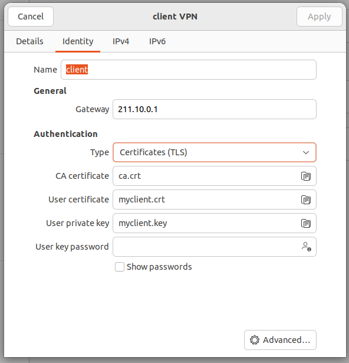
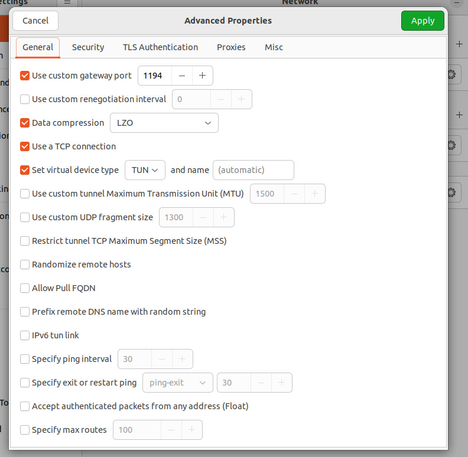

# 3과제

## Hostname Set

`hostnamectl set-hostname [hostname]`

## Static IP Set

- Kali.ver
    
    IP Address
    
    ---
    
    `vi /etc/network/interfaces`
    
    ```bash
    auto eth0
    iface eth0 inet dhcp
    up route add default gw 192.168.100.1
    ```
    
- Ubuntu.ver
    
    IP Address
    
    ---
    
    `vi /etc/netplan/01-network-manager-all.yaml`
    
    ```bash
    ethernets:
    ens33:
    	dhcp4: no
    	addresses: [192.168.100.1/24]
    ens37:
    	dhcp4: no
    	addresses: [172.20.11.254/23]
    ens38:
    	dhcp4: no
    	addresses: [10.10.10.1/30]
    	routes:
    		- to: 211.10.0.0/24
    		- via: 10.10.10.2
    ```
    
    `netplan apply`
    
- IPv6 Disable
    
    `vi /etc/default/grub`
    
    ```bash
    GRUB_CMDLINE_LINUX_DEFAULT="ipv6.disable=1"
    GRUB_CMDLINE_LINUX="ipv6.disable=1"
    ```
    
    `update-grub`
    
    `reboot`
    

## Routing

- office-PC ↔ ns && www && hack
    - office-PC
        
        `route add default gw 192.168.100.1`
        
    - ns
        
        `route add default gw 172.20.11.254`
        
    - cyber-ips
        
        `vi /etc/sysctl.conf`
        
        ```bash
        net.ipv4.ip_forward=1
        ```
        
- office-PC ↔ user
    - cyber-rt
        
        `vi /etc/sysctl.conf`
        
        ```bash
        net.ipv4.ip_forward=1
        ```
        
        `sysctl -p`
        
    - cyber-ips
        
        ### iptables Policy
        
        ---
        
        `iptables -A INPUT -p icmp —icmp-type echo-request -j ACCEPT`
        
        `iptables -A OUTPUT -p icmp —icmp-type echo-reply -j ACCEPT`
        
        `iptables -t nat -A POSTROUTING -s 192.168.100.0/24 -j SNAT -o ens38 —to-source 10.10.10.1`
        
        ### iptables Save && Restore
        
        ---
        
        `mkdir -p /etc/iptables`
        
        `iptables-save > /etc/iptables/rules.v4`
        
        `crontab -e`
        
        ```bash
        @reboot /usr/sbin/iptables-restore < /etc/iptables/rules.v4
        ```
        

## System Security

- Change SSH Port && Block Root Login
    
    `vi /etc/ssh/sshd_config`
    
    ```bash
    Port 51234
    PermitRootLogin no
    ```
    
    `service sshd restart`
    
- SSH Security
    
    `vi /etc/ssh/sshd_config`
    
    ```bash
    AllowUsers cyber@192.168.100.0/24
    ```
    

## Software Security

- DNS Server (ns)
    - office-PC
        
        `vi /etc/resolv.conf`
        
        ```bash
        nameservers 172.20.10.1
        ```
        
        `chattr +i /etc/resolv.conf`
        
    - ns
        - bind9 Status && 53 Port check
            
            `service bind9 start`
            
            `netstat -nat` <- Port check
            
        - bind9 Configuration
            
            `vi /etc/bind/named.conf.options`
            
            ```bash
            options {
            	directory "/var/cache/bind";
            	
            	auth-nxdomain no;
            	listen-on port 53 { localhost; 192.168.100.0/24; };
            	allow-query { any; };
            	forwarders { 172.20.11.254; };
            	recursion yes;
            };
            ```
            
            `vi /etc/bind/named.conf.local`
            
            ```bash
            //FORWARD ZONE
            zone "cyber23.com" IN {
            	type master;
            	file "/var/cache/bind/cyber23.com.zone";
            };
            
            //REVERSE ZONE
            zone "10.20.172.in-addr.arpa" IN {
            	type master;
            	file "cyber23.com.zone.rev";
            };
            ```
            
            `cp /etc/bind/db.local /var/cache/bind/cyber23.com.zone`
            
            `vi /var/cache/bind/cyber23.com.zone`
            
            ```bash
            ;BIND data file for local loopback interface
            ;
            $TTL    86400
            @       IN      SOA     cyber23.com. root.cyber23.com. (
                                          2         ; Serial
                                     604800         ; Refresh
                                      86400         ; Retry
                                    2419200         ; Expire
                                     604800 )       ; Negative Cache TTL
            ;
            @       IN      NS      cyber23.com.
                    IN      A       172.20.10.1
            ;Arecords
            ns      IN      A       172.20.10.1
            www     IN      A       172.20.10.2
            info    IN      A       172.20.10.2
            ```
            
            `cp /etc/bind/db.local /var/cache/bind/cyber23.com.zone.rev`
            
            `vi /var/cache/bind/cyber23.com.zone.rev`
            
            ```bash
            $TTL    86400
            ; BIND reverse data file for local loopback interface
            ;
            @       IN      SOA     localhost. root.localhost. (
                                          2         ; Serial
                                     604800         ; Refresh
                                      86400         ; Retry
                                    2419200         ; Expire
                                     604800 )       ; Negative Cache TTL
            ;
            @       IN      NS      ns.
            1       IN      PTR     ns.cyber23.com.
            2       IN      PTR     www.cyber23.com.
            2       IN      PTR     info.cyber23.com.
            ```
            
            `named-checkconf`
            
            `named-checkzone cyber23.com /var/cache/bind/cyber23.com.zone`
            
            `named-checkzone 172.20.10.1 /var/cache/bind/cyber23.com.zone`
            
            `named-checkzone 172.20.10.2 /var/cache/bind/cyber23.com.zone`
            
            `service bind9 restart`
            
- www Server
    
    `mkdir /var/www/html/main`
    
    `mkdir /var/www/html/info`
    
    `vi /var/www/html/main/index.html`
    
    ```html
    <!DOCTYPE html>
    <html>
    <head>
    <meta charset="UTF-8"/>
    <title> CYBER23 </title>
    <style>
    body {
            background-image: url('./img/info.jpg');
            background-repeat: no-repeat;
            background-attachment: fixed;
            background-size: 100% 100%;
    }
    p, h1{
            font-size: 20px;
            color: white;
    }
    </style>
    </head>
    
    <body>
            <p>cyber23.com Page</p>
            <hr>
            <p> Hompage Renewal..</p>
    </body>
    </html>
    ```
    
    `vi /etc/hosts`
    
    ```bash
    172.20.10.2 www.cyber23.com
    172.20.10.2 www.cyber23.com
    
    172.20.10.2 info.cyber23.com
    172.20.10.2 info.cyber23.com
    ```
    
    `a2enmod ssl`
    
    `service apache2 restart`
    
    `cp /etc/apache2/sites-avaliable/default-ssl.conf /etc/apache2/sites-avaliable/www.conf`
    
    `cp /etc/apache2/sites-avaliable/default-ssl.conf /etc/apache2/sites-avaliable/info.conf`
    
    `vi /etc/apache2/sites-avaliable/www.conf`
    
    ```bash
    ServerName cyber23.com
    ServerAlias www.cyber23.com
    
    DocumentRoot /var/www/html/main
    
    .
    .
    .
    
    SSLEngine on
    SSLCertificateFile /etc/apache2/ssl/cyber23.crt
    SSLCertificateKeyFile /etc/apache2/ssl/cyber23.key
    ```
    
    `vi /etc/apache2/sites-avaliable/info.conf`
    
    ```bash
    ServerName cyber23.com
    ServerAlias info.cyber23.com
    
    DocumentRoot /var/www/html/info
    
    .
    .
    .
    
    SSLEngine on
    SSLCertificateFile /etc/apache2/ssl/cyber23.crt
    SSLCertificateKeyFile /etc/apache2/ssl/cyber23.key
    ```
    
    `mkdir /etc/apache2/ssl`
    
    `openssl req -x509 -nodes -days 365 -newkey rsa:2048 -keyout /etc/apache2/ssl/cyber23.key -out /etc/apache2/ssl/cyber23.crt`
    
    KR / Gwangju / Gwangju / home / home /cyber23.com / cyber23.com
    
    `a2ensite www / a2ensite info`
    
    `a2enmod rewrite`
    
    `service apache2 restart`
    
    `vi /etc/apache2/sites-enabled/000-default.conf`
    
    ```bash
    RewriteEngine On
    RewriteCond %{HTTPS} off
    RewriteRule .* https://%{SERVER_NAME}%{REQUEST_URI} [R,L]
    ```
    
- info Auth Set
    
    `vi /etc/apache2/apache2.conf`
    
    ```bash
    <Directory /var/www/html/info>
    	Options Indexes FollowSymLinks
    	AllowOverride All
    	Require all granted
    </Directory>
    ```
    
    `vi /var/www/html/info/.htaccess`
    
    ```bash
    AuthName "cyber23.com"
    AuthType Basic
    AuthUserFile /var/www/html/info/.htauth
    require valid-user
    ```
    
    `htpasswd -c /var/www/html/info/.htauth authUser`
    
    ID : authUser
    
    PW : cyber2023!@
    
- FTP Configuration (www)
    
    `adduser webmaster`
    
    `vi /etc/vsftpd.conf`
    
    ```bash
    listen=YES
    listen_ipv6=NO
    local_enable=YES
    
    chroot_local_user=YES
    
    rsa_cert_file=/etc/ssl/private/vsftpd.pem
    rsa_private_key_file=/etc/ssl/private/vsftpd.pem
    ssl_enable=YES
    
    #ADD
    allow_writeable_chroot=YES
    local_root=/var/www
    ```
    
    `service vsftpd restart`
    
    `chmod 755 /var/www/html`
    
    `chown webmaster /var/www/html`
    
    `openssl req -x509 -nodes -days 3650 -newkey rsa:2048 -keyout /etc/ssl/private/vsftpd.pem -out /etc/ssl/private/vsftpd.pem`
    
    `echo “/sbin/nologin” >> /etc/shells`
    
    `usermod -s /sbin/nologin webmaster`
    
- DHCP
    
    `vi /etc/dhcp/dhcpd.conf`
    
    ```bash
    authoritative;
    
    subnet 192.168.100.0 netmask 255.255.255.0 {
    	range 192.168.100.10 192.168.100.50;
    }
    
    option domain-name-servers 172.20.10.1;
    option routers 192.168.100.1;
    ```
    
    `vi /etc/default/isc-dhcp-server`
    
    ```bash
    INTERFACESv4="ens33"
    ```
    
    `service isc-dhcp-server restart`
    
    `service isc-dhcp-server status`
    
- cyber-rt Security
    
    `iptables —policy INPUT DROP`
    
    `iptables —policy OUTPUT DROP`
    
    `iptables —policy FORWARD DROP`
    
    `iptables -A INPUT -p icmp -j ACCEPT`
    
    `iptables -A OUTPUT -p icmp -j ACCEPT`
    
    `iptables -A FORWARD -p icmp -j ACCEPT`
    
    `iptables -t nat -A POSTROUTING -s 10.10.10.1 -j SNAT —to-source 211.10.0.1`
    
    `iptables -t nat -A PREROUTING -p tcp —dport 22 -j DNAT —to-destination 10.10.10.1:51234`
    
    `iptables -A FORWARD -p tcp —dport 51234 -j ACCEPT`
    
    `iptables -A INPUT -p tcp —dport 51234 -j ACCEPT`
    
    `iptables -A OUTPUT -p tcp —dport 51234 -j ACCEPT`
    
    `iptables -A FORWARD -p tcp —sport 51234 -j ACCEPT`
    
    `iptables -A INPUT -p tcp —sport 51234 -j ACCEPT`
    
    `iptables -A OUTPUT -p tcp —sport 51234 -j ACCEPT`
    
    **`Save`**
    
- openVPN
    
    `make-cadir ~/keys && cd ~/keys`
    
    `vi vars`
    
    ```bash
    set_var EASYRSA_REQ_COUNTRY "KR"
    set_var EASYRSA_REQ_PROVINCE "Gwangju"
    set_var EASYRSA_REQ_CITY "Gwangsan"
    set_var EASYRSA_REQ_ORG "GSM"
    set_var EASYRSA_REQ_EMAIL "s21051@gsm.hs.kr"
    set_var EASYRSA_REQ_OU "Cyber Security"
    ```
    
    `./easyrsa init-pki`
    
    `./easyrsa build-ca ( cyber2023!@ )` //Certification Create ( ca.crt )
    
    `./easyrsa gen-req myserver nopass` //Server PrivateKey Create ( myserver.key )
    
    `./easyrsa sign-req server myserver` //Server Certification Create ( myserver.crt )
    
    `./easyrsa gen-req myclient nopass` //Client PrivateKey Create ( myclient.key )
    
    `./easyrsa sign-req client myclient` //Client Certification Create ( myclient.crt )
    `./easyrsa gen-dh` //Diffie Hellman Parameter Create ( dh.pem )
    
    Server/Client
    
    `mkdir /etc/keys`
    
    <aside>
    😇 VPN Server = myserver.crt / myserver.key / ca.crt / dh.pem
    VPN Client = myclient.crt / myclient.key / ca.crt
    
    </aside>
    
    - Server
        
        `cp /usr/share/doc/openvpn/examples/sample-config-files/server.conf /etc/openvpn/server`
        
        `vi /etc/openvpn/server/server.conf`
        
        ```bash
        port 1194
        
        proto tcp
        dev tun
        
        ca /etc/keys/ca.crt
        cert /etc/openvpn/myserver.crt
        key /etc/keys/myserver.key
        dh /etc/keys/dh.pem
        
        server 192.168.200.0 255.255.255.0
        client-to-client
        
        comp-lzo
        persist-key
        persist-tun
        verb 4
        ```
        
        `crontab -e`
        
        ```bash
        @reboot /usr/sbin/openvpn --config /etc/openvpn/server/server.conf
        ```
        
    - cyber-rt
        
        `iptables -t nat -A PREROUTING -s 211.10.0.2 -p tcp —dport 1194 -j DNAT —to-destination 10.10.10.1:1194`
        
        `iptables -t nat -A PREROUTING -p tcp —dport 1194 -j DNAT —to-destination 211.10.0.2:1194`
        
        `iptables -A INPUT -p tcp —dport 1194 -j ACCEPT`
        
        `iptables -A OUTPUT -p tcp —dport 1194 -j ACCEPT`
        
        `iptables -A FORWARD -p tcp —dport 1194 -j ACCEPT`
        
        `iptables -A INPUT -p tcp —sport 1194 -j ACCEPT`
        
        `iptables -A OUTPUT -p tcp —sport 1194 -j ACCEPT`
        
        `iptables -A FORWARD -p tcp —sport 1194 -j ACCEPT`
        
    - Client
        
        
        
        
        
    
    Udp traceroute
    
- IPS
    
    `vi /etc/suricata/rules/ips.rules`
    
    ```bash
    drop icmp 192.168.100.0/24 any -> 172.20.10.2 any (msg:"Deny icmp to www server"; sid:100001;)
    alert icmp 192.168.100.0 any -> 172.20.10.1 any (msg:"Detect icmp to SERVER-FARM"; sid:100002;)
    drop tcp 192.168.100.0/24 any -> [hack] 22 (msg:"Deny SSH Aceess to HACK"; sid:100003;)
    alert tcp [192.168.100.0/24,192.168.200.0/24] any -> 172.20.10.2 [80,443] (msg:"Detected www to SERVER-FARM"; sid:100004;)
    
    ```
    
    `crontab -e`
    
    ```bash
    @reboot suricata -s /etc/suricata/rules/ips.rules -i ens33
    ```
    
    `vi /etc/suricata/suricata.yaml`
    
    ```bash
    rule-files:
    	- ips.rules
    ```
    
    `iptables -I INPUT -j NFQUEUE`
    
    `iptables -I OUTPUT -j NFQUEUE`
    
    `iptables -I FORWARD -j NFQUEUE`
    
    `adduser ips`
    
    `chmod +r /var/log/suricata/fast.log`
    
    in ips
    
    `vi ~/.bashrc`
    
    ```bash
    watch -d -n 5 'cat /var/log/suricata/fast.log'
    ```
